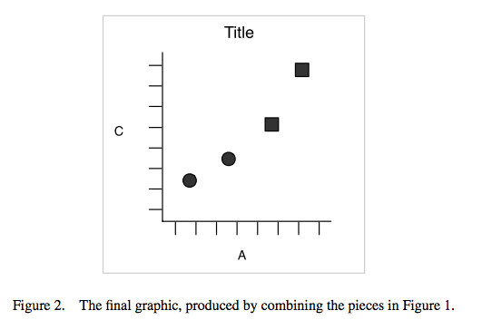

```{r setup, include=FALSE}
options(htmltools.dir.version = FALSE)
```

class: inverse, center, middle

# Data visualisation is...

---

class: center, middle


.large[The visual .green[analysis] of and .green[communication] of data]

---
### Telling a story...

[Florence Nightingale](http://bigbangdata.somersethouse.org.uk/florence-nightingale-a-data-pioneer/)


---
### Telling a story...

[Dear Data by Georgia Lupi and Stefanie Posavec](http://www.dear-data.com/thebook/)

.left-column[]


.right-column[]


---
### Telling a story...

[Amanda Cox: You Draw It: How Family Income
Predicts Children’s College Chances](https://www.nytimes.com/interactive/2015/05/28/upshot/you-draw-it-how-family-income-affects-childrens-college-chances.html)


---
class: center, middle


.large[Let's have a go: visualise the relationship between class of travel and survival on the Titanic]

[Get the data](https://www.dropbox.com/s/2a3b7w6ynn7zjq6/titanic.xls?dl=1)


---

class: center, middle

.large[The skills required to present data effectively are not all intuitive, but they can be learned.]

[Stephen Few: Show Me the Numbers](https://www.goodreads.com/book/show/543936.Show_Me_the_Numbers)

---
class: center, middle

.large[Every decision must have meaning]

---
### Visual perception

.pull-left[
```{r, echo=FALSE}

library(ggplot2)
x <- c(1, 2)
y <- c(1, 1)
z <- c(8, 9)
dat <- data.frame(x, y, z)

ggplot(dat, aes(x, y, size = z)) + geom_point(aes(x=x, y=y), data=dat, size=50, shape=1, fill="black") +
  theme(axis.line=element_blank(),
        axis.text.x=element_blank(),
        axis.text.y=element_blank(),
        axis.ticks=element_blank(),
        axis.title.x=element_blank(),
        axis.title.y=element_blank(),
        legend.position="none",
        panel.background=element_blank(),
        panel.border=element_blank(),
        panel.grid.major=element_blank(),
        panel.grid.minor=element_blank(),
        plot.background=element_blank()) + 
  scale_size_area() + 
  xlim(0.5,2.5) +
  geom_text(aes(label=z),hjust=0, vjust=6)
```
 ]

.pull-right[

```{r, echo=FALSE}

ggplot(dat, aes(as.factor(z), z)) + 
  geom_bar(stat="identity") +
  theme(axis.line=element_blank(),
        axis.text.x=element_blank(),
        axis.text=element_text(size=24),
      #    axis.text.y=element_blank(),
        axis.ticks=element_blank(),
          axis.title.x=element_blank(),
          axis.title.y=element_blank(),
        legend.position="none",
          panel.background=element_blank(),
        panel.border=element_blank(),
        panel.grid.major=element_blank(),
          panel.grid.minor=element_blank(),
        plot.background=element_blank()) +
  coord_flip() 
  
  

```
]

[Andy Kirk](https://www.sciencecomm.ch/images/Kirk%20Andy.pdf)
---
### Visual perception


[Robert Kosara](https://eagereyes.org/blog/2016/a-reanalysis-of-a-study-about-square-pie-charts-from-2009)


---
class: center, middle

[Andy Kirk](https://www.sciencecomm.ch/images/Kirk%20Andy.pdf)


---


[Edward Tufte](https://www.edwardtufte.com/tufte/books_vdqi)

---


[Nathan Yau](https://flowingdata.com/2009/01/15/flow-chart-shows-you-what-chart-to-use/)

---
class: center, middle
.large[Creating a plot in R]

---
### The grammar of graphics


[Wickham, H. (2010). A layered grammar of graphics. Journal of Computational and Graphical Statistics, 19(1), 3-28.](http://vita.had.co.nz/papers/layered-grammar.pdf)

---
### The grammar of graphics


[Wickham, H. (2010). A layered grammar of graphics. Journal of Computational and Graphical Statistics, 19(1), 3-28.](http://vita.had.co.nz/papers/layered-grammar.pdf)

---
### The grammar of graphics




[Wickham, H. (2010). A layered grammar of graphics. Journal of Computational and Graphical Statistics, 19(1), 3-28.](http://vita.had.co.nz/papers/layered-grammar.pdf)


---
class: center, middle
.large[Let's get to plotting in R]

[Get the script](https://www.dropbox.com/s/h1w6mal6vu8mhio/script.R?dl=0)

---
### `babynames`
Names of boys and girls born each year in the U.S. since 1880
```{r}
library(babynames)
babynames
```

---
class: center, middle


---
## The R code
```{r, eval=FALSE}
library(tidyverse) ; library(babynames) ; 

babynames %>%
  filter(name == "Mabel") %>%
  ggplot(data = ., aes(x = year, y = n)) +
  geom_line(aes(color = sex), size = 2) +
  scale_color_manual(values = c("#66c2a5", "#ff7f00"),
                     labels = c("Female", "Male")) +
  labs(title = "Babies named Mabel between 1880 and 2015",
       x = "Year", 
       y = "Frequency",
       caption = "Source: Social Security Administration",
       color = "") +
  theme_minimal() +
  theme(legend.position = "top")
ggsave("baby_plot.png", scale=1, dpi=300)
```

---
class: center, middle, inverse
# Break it down
---

### Load the R packages
<br>
.pull-left[
```r
*library(tidyverse) ; library(babynames) ; 

babynames %>%
  filter(name == "Mabel") %>%
  ggplot(data = ., aes(x = year, y = n)) +
  geom_line(aes(color = sex), size = 2) +
  scale_color_manual(values = c("#66c2a5", "#ff7f00"),
                     labels = c("Female", "Male")) +
  labs(title = "Babies named Mabel between 1880 and 2015",
       x = "Year", 
       y = "Frequency",
       caption = "Source: Social Security Administration",
       color = "") +
  theme_minimal() +
  theme(legend.position = "top")
ggsave("baby_plot.png", scale=1, dpi=300)
```
]

.pull-right[
```{r, echo=FALSE}
library(tidyverse) ; library(babynames) ; 
```
]

---
### Access the `babynames` data
<br>
.pull-left[
```r
library(tidyverse) ; library(babynames) ; 

*babynames %>%
  filter(name == "Mabel") %>%
  ggplot(data = ., aes(x = year, y = n)) +
  geom_line(aes(color = sex), size = 2) +
  scale_color_manual(values = c("#66c2a5", "#ff7f00"),
                     labels = c("Female", "Male")) +
  labs(title = "Babies named Mabel between 1880 and 2015",
       x = "Year", 
       y = "Frequency",
       caption = "Source: Social Security Administration",
       color = "") +
  theme_minimal() +
  theme(legend.position = "top")
ggsave("baby_plot.png", scale=1, dpi=300)
```
]

.pull-right[
```{r, echo=FALSE}
# library(tidyverse) ; library(babynames) ; 

babynames
```
]
---
### Subset the data
<br>
.pull-left[
```r
library(tidyverse) ; library(babynames) ; 

babynames %>%
* filter(name == "Mabel") %>%
  ggplot(data = ., aes(x = year, y = n)) +
  geom_line(aes(color = sex), size = 2) +
  scale_color_manual(values = c("#66c2a5", "#ff7f00"),
                     labels = c("Female", "Male")) +
  labs(title = "Babies named Mabel between 1880 and 2015",
       x = "Year", 
       y = "Frequency",
       caption = "Source: Social Security Administration",
       color = "") +
  theme_minimal() +
  theme(legend.position = "top")
ggsave("baby_plot.png", scale=1, dpi=300)
```
]

.pull-right[
```{r, echo=FALSE}
# library(tidyverse) ; library(babynames) ; 

babynames %>%
  filter(name == "Mabel")
```
]

---
### Initialise a `ggplot()` object, inherit the filtered data, and map variables to the x and y axes
.pull-left[
```r
library(tidyverse) ; library(babynames) ; 

babynames %>%
  filter(name == "Mabel") %>%
* ggplot(data = ., aes(x = year, y = n)) +
  geom_line(aes(color = sex), size = 2) +
  scale_color_manual(values = c("#66c2a5", "#ff7f00"),
                     labels = c("Female", "Male")) +
  labs(title = "Babies named Mabel between 1880 and 2015",
       x = "Year", 
       y = "Frequency",
       caption = "Source: Social Security Administration",
       color = "") +
  theme_minimal() +
  theme(legend.position = "top")
ggsave("baby_plot.png", scale=1, dpi=300)
```
]

.pull-right[
```{r, echo=FALSE}
# library(tidyverse) ; library(babynames) ; 

babynames %>%
  filter(name == "Mabel") %>%
  ggplot(data = ., aes(x = year, y = n))
```
]

---
### Use `geom_line()` to connect the observations, map the `sex` variable to colour and set the line thickness
.pull-left[
```r
library(tidyverse) ; library(babynames) ; 

babynames %>%
  filter(name == "Mabel") %>%
  ggplot(data = ., aes(x = year, y = n)) +
* geom_line(aes(color = sex), size = 2) +
  scale_color_manual(values = c("#66c2a5", "#ff7f00"),
                     labels = c("Female", "Male")) +
  labs(title = "Babies named Mabel between 1880 and 2015",
       x = "Year", 
       y = "Frequency",
       caption = "Source: Social Security Administration",
       color = "") +
  theme_minimal() +
  theme(legend.position = "top")
ggsave("baby_plot.png", scale=1, dpi=300)
```
]

.pull-right[
```{r, echo=FALSE}
# library(tidyverse) ; library(babynames) ; 

babynames %>%
  filter(name == "Mabel") %>%
  ggplot(data = ., aes(x = year, y = n)) +
  geom_line(aes(color = sex), size = 2)
```
]

---
### Specify which colours the `sex` variable is mapped to
<br>
.pull-left[
```r
library(tidyverse) ; library(babynames) ; 

babynames %>%
  filter(name == "Mabel") %>%
  ggplot(data = ., aes(x = year, y = n)) +
  geom_line(aes(color = sex), size = 2) +
* scale_color_manual(values = c("#66c2a5", "#ff7f00"),
*                    labels = c("Female", "Male")) +
  labs(title = "Babies named Mabel between 1880 and 2015",
       x = "Year", 
       y = "Frequency",
       caption = "Source: Social Security Administration",
       color = "") +
  theme_minimal() +
  theme(legend.position = "top")
ggsave("baby_plot.png", scale=1, dpi=300)
```
]

.pull-right[
```{r, echo=FALSE}
# library(tidyverse) ; library(babynames)  

babynames %>%
  filter(name == "Mabel") %>%
  ggplot(data = ., aes(x = year, y = n)) +
  geom_line(aes(color = sex), size = 2) +
  scale_color_manual(values = c("#66c2a5", "#ff7f00"),
                     labels = c("Female", "Male"))
```
]

---
### Add a title, label the axes, include a caption, and drop the legend title
<br>
.pull-left[
```r
library(tidyverse) ; library(babynames)  

babynames %>%
  filter(name == "Mabel") %>%
  ggplot(data = ., aes(x = year, y = n)) +
  geom_line(aes(color = sex), size = 2) +
  scale_color_manual(values = c("#66c2a5", "#ff7f00"),
                     labels = c("Female", "Male")) +
* labs(title = "Babies named Mabel between 1880 and 2015",
*      x = "Year", 
*      y = "Frequency",
*      caption = "Source: Social Security Administration",
*      color = "") +
  theme_minimal() +
  theme(legend.position = "top")
ggsave("baby_plot.png", scale=1, dpi=300)
```
]

.pull-right[
```{r, echo=FALSE}
# library(tidyverse) ; library(babynames)  

babynames %>%
  filter(name == "Mabel") %>%
  ggplot(data = ., aes(x = year, y = n)) +
  geom_line(aes(color = sex), size = 2) +
  scale_color_manual(values = c("#66c2a5", "#ff7f00"),
                     labels = c("Female", "Male")) +
  labs(title = "Babies named Mabel between 1880 and 2015",
       x = "Year", 
       y = "Frequency",
       caption = "Source: Social Security Administration",
       color = "")
```
]

---
### Use a `ggplot2` theme to format the chart
<br>
.pull-left[
```r
library(tidyverse) ; library(babynames)  

babynames %>%
  filter(name == "Mabel") %>%
  ggplot(data = ., aes(x = year, y = n)) +
  geom_line(aes(color = sex), size = 2) +
  scale_color_manual(values = c("#66c2a5", "#ff7f00"),
                     labels = c("Female", "Male")) +
  labs(title = "Babies named Mabel between 1880 and 2015",
       x = "Year", 
       y = "Frequency",
       caption = "Source: Social Security Administration",
       color = "") +
* theme_minimal() +
  theme(legend.position = "top")
ggsave("baby_plot.png", scale=1, dpi=300)
```
]

.pull-right[
```{r, echo=FALSE}
# library(tidyverse) ; library(babynames)  

babynames %>%
  filter(name == "Mabel") %>%
  ggplot(data = ., aes(x = year, y = n)) +
  geom_line(aes(color = sex), size = 2) +
  scale_color_manual(values = c("#66c2a5", "#ff7f00"),
                     labels = c("Female", "Male")) +
  labs(title = "Babies named Mabel between 1880 and 2015",
       x = "Year", 
       y = "Frequency",
       caption = "Source: Social Security Administration",
       color = "") +
  theme_minimal()
```
]

---
### Move the legend to the top of the plot
<br>
.pull-left[
```r
library(tidyverse) ; library(babynames)  

babynames %>%
  filter(name == "Mabel") %>%
  ggplot(data = ., aes(x = year, y = n)) +
  geom_line(aes(color = sex), size = 2) +
  scale_color_manual(values = c("#66c2a5", "#ff7f00"),
                     labels = c("Female", "Male")) +
  labs(title = "Babies named Mabel between 1880 and 2015",
       x = "Year", 
       y = "Frequency",
       caption = "Source: Social Security Administration",
       color = "") +
  theme_minimal() +
* theme(legend.position = "top")
ggsave("baby_plot.png", scale=1, dpi=300)
```
]

.pull-right[
```{r, echo=FALSE}
# library(tidyverse) ; library(babynames)  

babynames %>%
  filter(name == "Mabel") %>%
  ggplot(data = ., aes(x = year, y = n)) +
  geom_line(aes(color = sex), size = 2) +
  scale_color_manual(values = c("#66c2a5", "#ff7f00"),
                     labels = c("Female", "Male")) +
  labs(title = "Babies named Mabel between 1880 and 2015",
       x = "Year", 
       y = "Frequency",
       caption = "Source: Social Security Administration",
       color = "") +
  theme_minimal() +
  theme(legend.position = "top")
```
]

---
### Save the plot as a png at a high resolution
<br>
.pull-left[
```r
library(tidyverse) ; library(babynames) 

babynames %>%
  filter(name == "Mabel") %>%
  ggplot(data = ., aes(x = year, y = n)) +
  geom_line(aes(color = sex), size = 2) +
  scale_color_manual(values = c("#66c2a5", "#ff7f00"),
                     labels = c("Female", "Male")) +
  labs(title = "Babies named Mabel between 1880 and 2015",
       x = "Year", 
       y = "Frequency",
       caption = "Source: Social Security Administration",
       color = "") +
  theme_minimal() +
  theme(legend.position = "top")
*ggsave("baby_plot.png", scale=1, dpi=300)
```
]

.pull-right[
```{r, echo=FALSE}
# library(tidyverse) ; library(babynames)  

babynames %>%
  filter(name == "Mabel") %>%
  ggplot(data = ., aes(x = year, y = n)) +
  geom_line(aes(color = sex), size = 2) +
  scale_color_manual(values = c("#66c2a5", "#ff7f00"),
                     labels = c("Female", "Male")) +
  labs(title = "Babies named Mabel between 1880 and 2015",
       x = "Year", 
       y = "Frequency",
       caption = "Source: Social Security Administration",
       color = "") +
  theme_minimal() +
  theme(legend.position = "top")
```
]

---
class: center, middle, inverse

# Your turn


